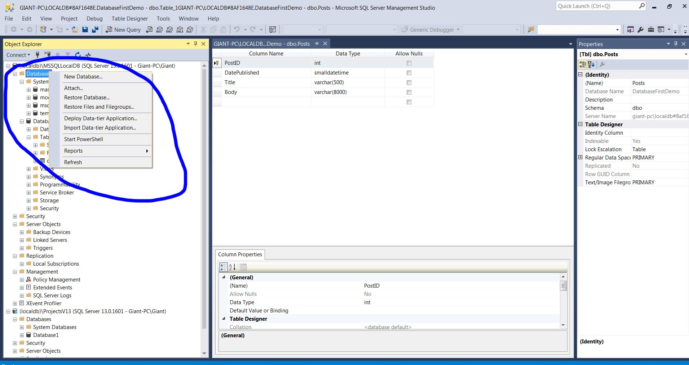
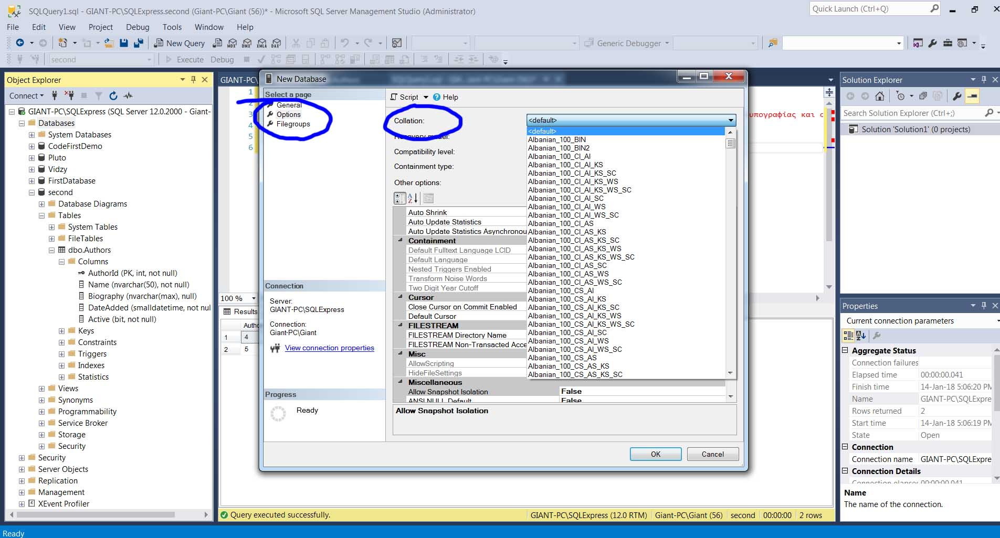
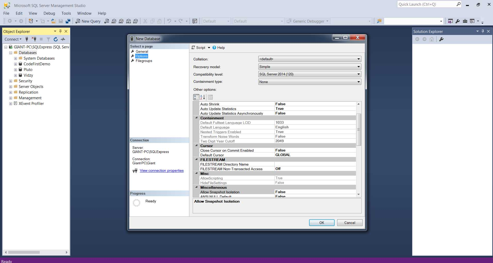
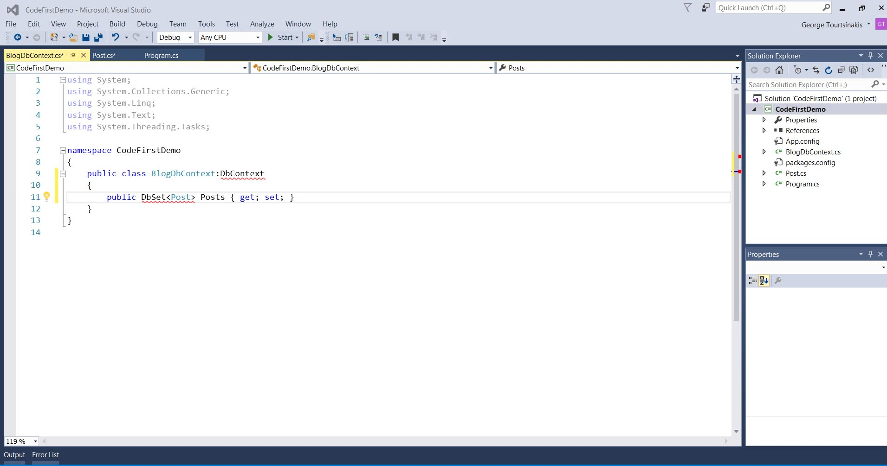

<h1>Entity Framework</h1>

To use a database we need a persistence framework. You are able to load objects from or save them to a database. It is possible to create something like that custom so we can connect with the database but it would take a log time. 

This is where Entity framework shines. You <strong>no longer</strong> have to write
<ul>
<li>Stored procedures</li>
<li>Manage Database Connections</li>
<li>Manually Mapping </li>
</ul>

Entity framework handles all the dirty work for us. The amazing thing with Entity is that you use objects to do stuff with the database. 

<section>
<h2>Workflows</h2>

You can check the video Workflows.wmv from microsoft. We have three workflows to build models according to our needs.

<h3>Database First</h3>
<ul>
<li>We design our tables</li>
<li>Entity framework generates domain classes</li>
</ul>

Check project Database-First-Workflow

<h3>Code First</h3>
<ul>
<li>Create domain classes</li>
<li>Entity framework generates database tables</li>
</ul>

<h3>Model First</h3>
<ul>
<li>Use Visual designer to model our classes and associations</li>
<li>UML diagram</li>
<li>Based on the diagram Entity framework will create the database and tables</li>
</ul>

This approach isn't used.

</section>

<section>
<h3>Installation of Sql Express</h3>

<h4>How to Install SQL Server 2014 Express and SQL Server Management Studio 2014 Express</h4>
https://www.youtube.com/watch?v=E_zFM7mzFUg  

<h4>SQL Server - Create a Database </h4>

The path created automatically is a little strange so we might need t change it and add the database to a folder we want. We will get two files one mdf which is something that sequel server handles and one ldf which has all the logs.

<a href="https://www.youtube.com/watch?v=WKWZZcrin5I">https://www.youtube.com/watch?v=WKWZZcrin5I</a>
 

<h4><strong>!IMPORTANT Database with foreign characters</strong></h4>

Some characters like greek characters will not appear as supposed in database or searches even if you have used nvarchar. To fix this you either have to select correct collation in daabase creation  or in your queries before the string literal you should put N
<pre>
INSERT Authors
	([Name], Biography, DateAdded)
VALUES ('Stephen King',N'Το Lorem Ipsum είναι απλά ένα κείμενο', 'January 18,2018')

</pre>

<h5>Options for database</h5>

While we create a new database we have some Options to modify
 Also we can have a filegroup which is a location where files are stored. So we can have multiple files in various drives

<h4>Installation and Database first approach</h4>

To create a database you can use either Microsoft SQL Server Management Studio or from Visual Studio. You go to Object Explorer as shown in <strong>object_explorer.jpg</strong> and then you create a database as in <strong>new_database.jpg </strong>.Similarly you create tables etc.

<h4><strong></strong></h4>

To use Entity framework we have to install it from Nuget Package Manager as shown <strong>entity-installation.jpg</strong>. Then at Package Manager Console we write :   install-package EntityFramework

<h5>Importing existing Database to project and Connecting to database</h5>

After that we go to Solution Explorer and we add a New Item ADO.NET Entity Data Model which will represent the mapping between the database tables and our domain classes. If you already have a database you choose <strong>EF Designer from Database</strong>. Then at New Connection Microsoft SQL Server. 

To connect to the database we need server name, database name and credentials as shown in <strong>connect_to_database.jpg</strong>.Test connection to see if everything works fine. Now entity frameworks looks at our database and discovers the table views and stored procedures as shown in <strong>ef_mappiong_ready.jpg</strong>

<h5>Create a relation in Management Studio</h5>

https://www.youtube.com/watch?v=PHjwX-cexIA

<h4>Entity Data Model edmx</h4>

Edmx is our data model that is created by entity framework so we can use it as shown in <strong>edmx.jpg</strong>. When expanding the edmx file we will see a tt extension which stands for T for template. It's a way to generate code based on a template. If we expand this we ll see the actual generated code as shown in <strong>edmx_exapnded.jpg</strong>.
It provides a simple API to load data or save it to the database.

We have properties created according to tables as shown in <strong>edmx_property.jpg</strong> which derive from DbContext.

<h5>NameModel.tt</h5>

We also have a class with properties according to tables created as shown in <strong>edmx_class_according_to_table.jpg</strong> with properties based on columns.

With database first approach everytime we want to make a change to my model we start from the database and then come back to edmx file and refresh it.

</section>

<section>
<h3>DB context</h3>

This applies to both Database first and Code first models. Create an instance which is the name of our project and the the end Entities. In our case the project is DatabaseFirstDemo so the cllass we need will be DatabaseFirstDemoEntities.

<pre>
var context = new DatabaseFirstDemoEntities();
</pre>
<h5>Creating new content for our table</h5>
<pre>
var post = new Post()
{
    Body = "Body",
    DatePublished = DateTime.Now,
    Title = "Title",
     PostID = 1
};
</pre>

Then we add it to memory

<pre>
context.Posts.Add(post);
</pre>

Add post to db by saving changes

<pre>
context.SaveChanges();
</pre>

We didn't have to work with ADO.NET  classes like sequel connection and sequel commnd. Entiyty framework took care eveything

To verify eveything went smoothly go to Management Studio and check <strong>show_rows_from_table.jpg</strong>
</section>

<section>
<h4>Code first approach</h4>

First we create our application. Then we install entity framework similiar with the above installation. With code first we start with code so we don't have to go to Management Studio.

Create a class with the properties that you want to be
in table. The class name's will be the table's name and the properties its columns. We also need a DbContext which is an abstraction that is used over the database so we can load our saved data as shown in
<pre>
public class PlutoContext : DbContext
{
}
</pre>
 
<strong>Don't forget to use </strong>
<pre>
using System.Data.Entity;
</pre>
 

<h5>Specify the connection string to database</h5>

Go to App.config as shown in <strong>code_first_app_config.jpg</strong>. Then you add your connection string which must be the same name as your Dbcontext as shown in <strong>code_first_dbcontext.jpg</strong>. The connection string at App.config should look like <strong>
code_first_connection_string.jpg
</strong>. The initial catalog is the database name  and integrated security means we use Windows Authentication.
Finally we have to give providerName which is System.Data.Sqlclient. It is requiered so code first works.

After the above we need to enable code first migrations. Again at Package Manager Console we type enable-migrations

<strong>DON'T FORGET TO HAVE   using System.Data.Entity;  
WHERE YOU CREATE THE DBCONTEXT</strong>

All the above are done once. If we want to make changes to our model we start with the code. Every time we make a change we should add a migration. We go to Package Manager Console and we write add-migration along with a name of what we did.

We will get the migration as shown in <strong>code_first_migration_finished.jpg
</strong>and a new folder created called Migrations. Inside this foder we have the migration's name with date time stamp.

With code first migrations we can take any database and take it to any version whether that version is higher or lower and this is very powerful if you maintaining different versions of an application.

Then we have to run it. Entity framework looks at the database and figures out what migrations need to run on the database to bring it up to date. It will get the migration classes converts them to SQL code and runs it on a database. To run the migration back at the Package Manager Consolewe write :   update-database

</section>

<section>
<h6>Code First or Database first</h6>

It's matter of personal opinion and both can do exactly same stuff. With Code First you have:

<ul>
<li>Full versioning of database with any migration you make</li>
<li>Productivity since it's faster to write code than use mouse</li>
<li>Deeper learning curve</li>
<li>Maybe you have a legacy database deployment tool so you might not be able to use code </li>

</ul>

</section>
