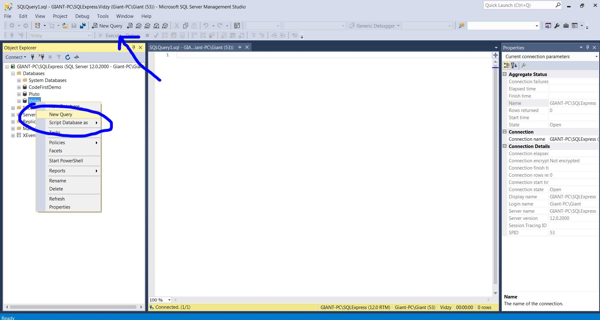
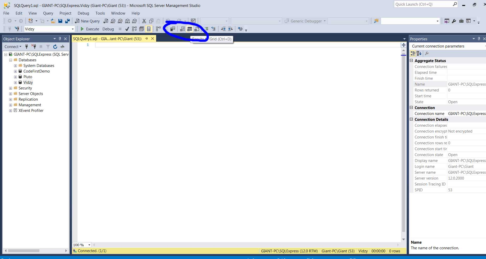
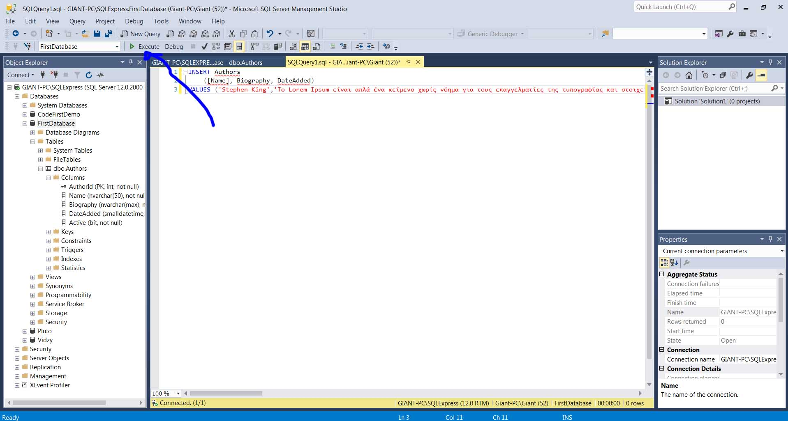
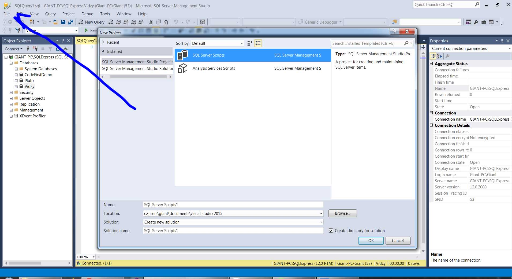
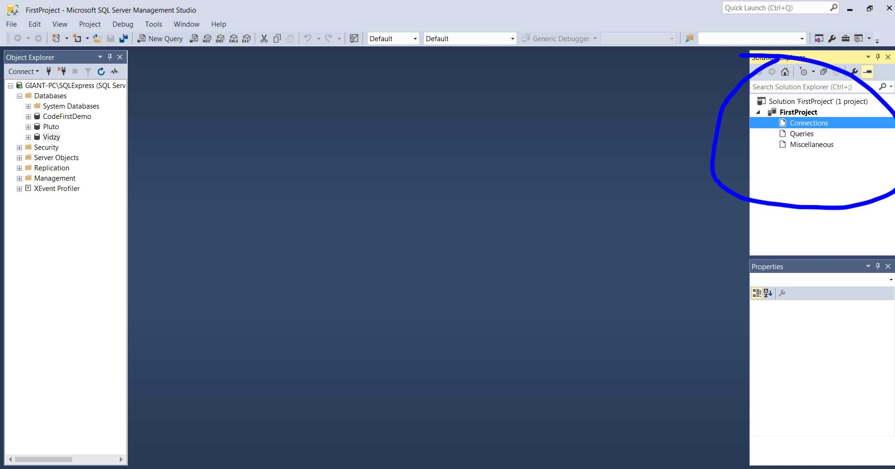
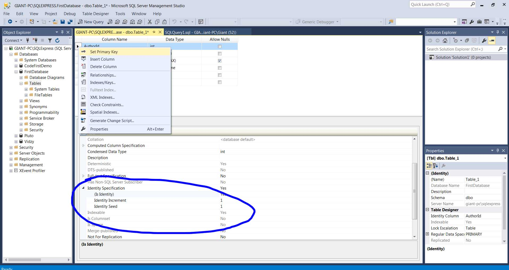
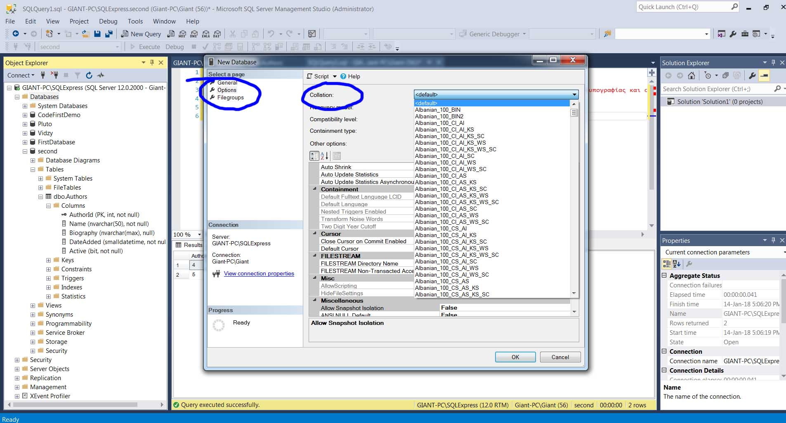
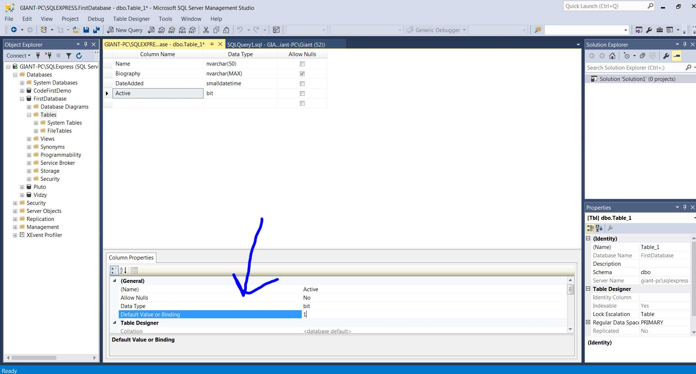

<h1>SQL and Management Studio</h1>

<h2>Running queries through management studio</h2>

After you have connected to SQL server you are running as shown in  Chapter 1 and Chapter 2 we can run queries by clicking
the New Query as shown <strong>queries_management_studio.jpg</strong>.

You can also save results to a file, to grid , to text.

To run a query you click Execute or Ctrl+e in a chosen highlighted script. To check if we have written correct the query we can click Parse.

<h3>Premade queries scripts</h3>

We can create a new project that wil have premade scripts that will have queries so we can add them anywhere we want.

After we will have a solution explorer as in Visual Studio.
We can add connections which can be used in a different desktop without having to remember all those details. We can also add queries that will be used again and again.

<h3>Creating tables and datatypes</h3>

To create a table you right click in expanded database and then you add the columns with corerct datatype.

<h4>Columns and datatypes</h4>

To create a column above a current column right click and then Insert Column

<a href="https://www.w3schools.com/sql/sql_datatypes.asp">https://www.w3schools.com/sql/sql_datatypes.asp</a>
<ul>
<li><strong>Primary key</strong> - This is a unique key/id so we can differentiate our rows. For example if we had two same names in our database. That's why primary key is unique. To create a primary key you right click in the column you want and also you must choose (Is Identity)

</li>
<li><strong>Allow nulls</strong> - if not clicked we always have to force sql server to have data</li>
<li>nvarchar - stores string data and is preferred against varchar since it holds any unicode characters </li>
<li><strong>nchar</strong> - you should always put exact characters while in nvarchar is up to characters </li>
<li><strong>datetime</strong> -
<a href="https://docs.microsoft.com/en-us/sql/t-sql/data-types/datetime-transact-sql">https://docs.microsoft.com/en-us/sql/t-sql/data-types/datetime-transact-sql</a> Used for dates and according to what we use it has precision to seconds etc which might not be needed. The best option is smalldatetime. It is stored as literal string and sequel server will manage the casting to datetime. We must be careful with dateformats,languages and conversions</li>
<li><strong>bit</strong> - it's used for boolean values like 0,1</li>

</ul>
<h4><strong>!IMPORTANT Database with foreign characters</strong></h4>

Some characters like greek characters will not appear as supposed in database or searches even if you have used nvarchar. To fix this you either have to select correct collation in daabase creation  or in your queries before the string literal you should put N
<pre>
INSERT Authors
	([Name], Biography, DateAdded)
VALUES ('Stephen King',N'Το Lorem Ipsum είναι απλά ένα κείμενο', 'January 18,2018')

</pre>

<h5>Columns properties</h5>
<ul>
<li>Default values for columns

</li>

</ul>

<h4>SQL Syntax </h4>

Microsoft uses the T-SQL(Transcat Structured Query Language) standard. You can use either " " or the most common case is to use [ ] for the the names. 
<a href="https://msdn.microsoft.com/en-us/library/windows/desktop/aa372021(v=vs.85).aspx">https://msdn.microsoft.com/en-us/library/windows/desktop/aa372021(v=vs.85).aspx</a> 
<a href="https://www.w3schools.com/sql/sql_syntax.asp">https://www.w3schools.com/sql/sql_syntax.asp</a>

<h5>Comments</h5>

As slash asterisk asterisk slash as in javascript, c# etc 

<h5>Insert rows</h5>
<ol>
<li>First we add the table name</li>
<li>Then in parenthesis the columns we will insert data</li>
<li>Values seperated with comma same order as columns and for string we should use literal string so two single quoetes</li>
</ol>

<pre>
INSERT Authors
	([Name], Biography, DateAdded)
VALUES ('Stephen King','Το Lorem Ipsum είναι απλά ένα κείμενο χωρίς νόημα για τους επαγγελματίες της τυπογραφίας και στοιχειοθεσίας. Το Lorem Ipsum είναι το επαγγελματικό πρότυπο όσον αφορά το κείμενο χωρίς νόημα, από τον 15ο αιώνα, όταν ένας ανώνυμος τυπογράφος πήρε ένα δοκίμιο και ανακάτεψε τις λέξεις για να δημιουργήσει ένα δείγμα βιβλίου. Όχι μόνο επιβίωσε πέντε αιώνες, αλλά κυριάρχησε στην ηλεκτρονική στοιχειοθεσία, παραμένοντας με κάθε τρόπο αναλλοίωτο. Έγινε δημοφιλές τη δεκαετία του 60 με την έκδοση των δειγμάτων της Letraset όπου περιελάμβαναν αποσπάσματα του Lorem Ipsum, και πιο πρόσφατα με το λογισμικό ηλεκτρονικής σελιδοποίησης όπως το Aldus PageMaker που περιείχαν εκδοχές του Lorem Ipsum.', 'January 18,2018')

</pre>

<h5>Return all rows from column Authors</h5>

<pre>
SELECT * FROM Authors
</pre>

Or we can return the columns we want by their names and comma between instead of asterisk.

