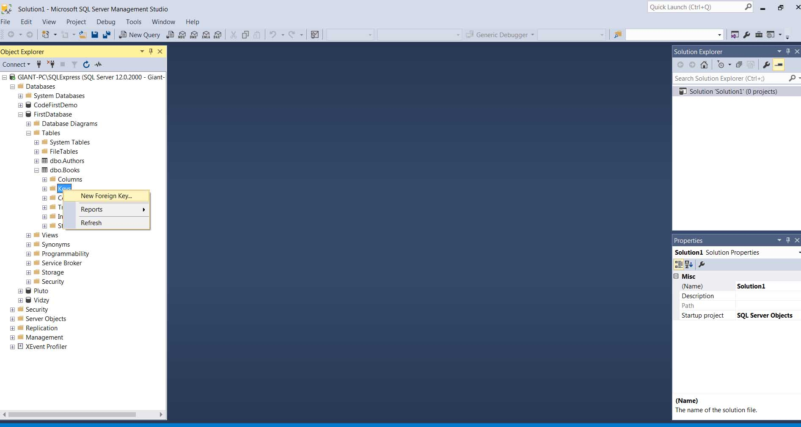
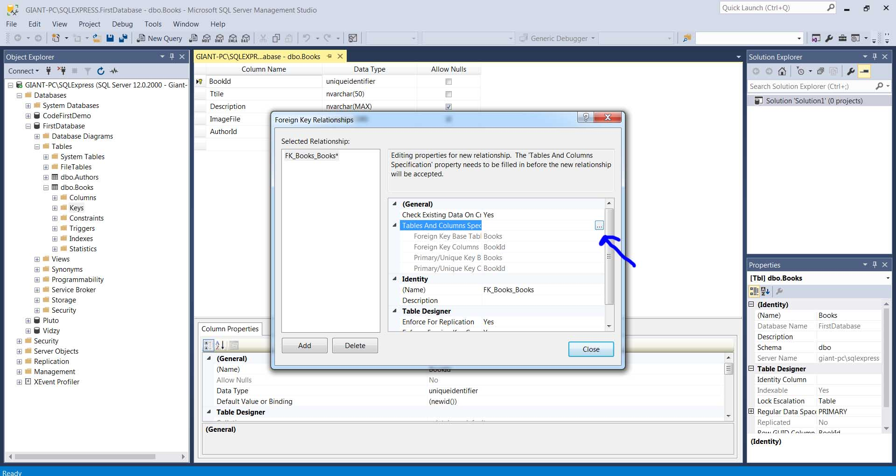
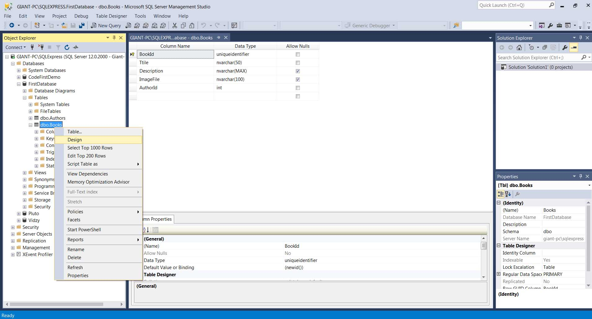
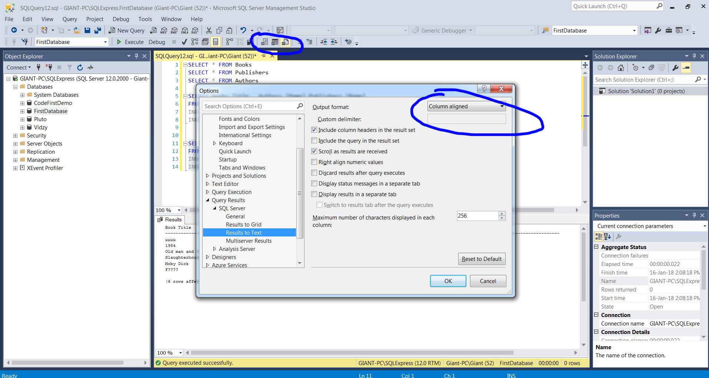
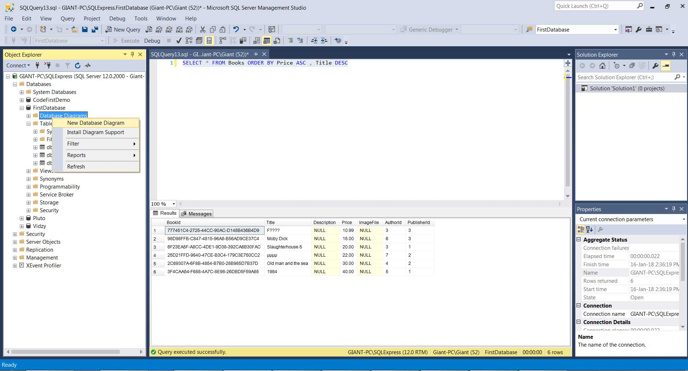
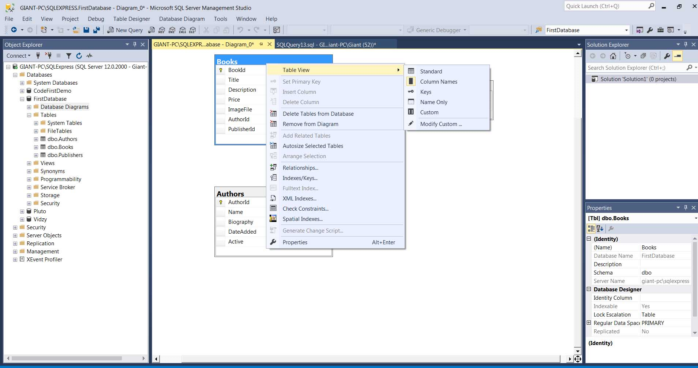

<h1>SQL and Management Studio</h1>

<h2>Running queries through management studio</h2>

After you have connected to SQL server you are running as shown in  Chapter 1 and Chapter 2 we can run queries by clicking
the New Query as shown <strong>queries_management_studio.jpg</strong>.

You can also save results to a file, to grid , to text.

To run a query you click Execute or Ctrl+e in a chosen highlighted script. To check if we have written correct the query we can click Parse.

To save queries/scripts as sql file you can click the blue diskette.

<h3>Premade queries scripts</h3>

We can create a new project that wil have premade scripts that will have queries so we can add them anywhere we want.

After we will have a solution explorer as in Visual Studio.
We can add connections which can be used in a different desktop without having to remember all those details. We can also add queries that will be used again and again.

<h3>Creating tables and datatypes</h3>

To create a table you right click in expanded database and then you add the columns with corerct datatype.

<h4>Columns and datatypes</h4>

To create a column above a current column right click and then Insert Column

<a href="https://www.w3schools.com/sql/sql_datatypes.asp">https://www.w3schools.com/sql/sql_datatypes.asp</a>
<ul>
<li><strong>Primary key</strong> - This is a unique key/id so we can differentiate our rows. For example if we had two same names in our database. That's why primary key is unique. To create a primary key you right click in the column you want and also you must choose (Is Identity)

</li>

<li><strong>Allow nulls</strong> - if not clicked we always have to force sql server to have data</li>

<li>nvarchar - stores string data and is preferred against varchar since it holds any unicode characters </li>

<li><strong>nchar</strong> - you should always put exact characters while in nvarchar is up to characters </li>

<li><strong>datetime</strong> -
<a href="https://docs.microsoft.com/en-us/sql/t-sql/data-types/datetime-transact-sql">https://docs.microsoft.com/en-us/sql/t-sql/data-types/datetime-transact-sql</a> Used for dates and according to what we use it has precision to seconds etc which might not be needed. The best option is smalldatetime. It is stored as literal string and sequel server will manage the casting to datetime. We must be careful with dateformats,languages and conversions</li>
<li><strong>bit</strong> - it's used for boolean values by putting 0/1</li>

<li><strong>uniqueidentifier</strong> - This is something unique created and it's very hard to have something same in whole oever the world. If it's our primary key we have to set RowGuid at its properties at Yes.</li>

<li><strong>smallmoney</strong> - Data types that represent monetary or currency values. </li>

</ul>
<h4><strong>!IMPORTANT Database with foreign characters</strong></h4>

Some characters like greek characters will not appear as supposed in database or searches even if you have used nvarchar. To fix this you either have to select correct collation in daabase creation  or in your queries before the string literal you should put N
<pre>
INSERT Authors
	([Name], Biography, DateAdded)
VALUES ('Stephen King',N'Το Lorem Ipsum είναι απλά ένα κείμενο', 'January 18,2018')

</pre>

<h5>Columns properties</h5>
<ul>
<li>Default values for columns

</li>

</ul>

<h4>Connecting tables and <strong>Foreign Keys</strong> </h4>

First click new Foreign Key in the column in Keys

Then we must make the relation

<h3>Editing tables</h3>

Go to design view

We also can edit rows by choosing Edit Top 200 rows. By right clicking you can choose to delete the row also.

<h4>SQL Syntax </h4>

Microsoft uses the T-SQL(Transcat Structured Query Language) standard. You can use either " " or the most common case is to use [ ] for the the names. 
<a href="https://msdn.microsoft.com/en-us/library/windows/desktop/aa372021(v=vs.85).aspx">https://msdn.microsoft.com/en-us/library/windows/desktop/aa372021(v=vs.85).aspx</a> 
<a href="https://www.w3schools.com/sql/sql_syntax.asp">https://www.w3schools.com/sql/sql_syntax.asp</a>

<h5>Comments</h5>

As slash asterisk asterisk slash as in javascript, c# etc 

<h5>Insert rows</h5>
<ol>
<li>First we add the table name</li>
<li>Then in parenthesis the columns we will insert data</li>
<li>Values seperated with comma same order as columns and for string we should use literal string so two single quoetes</li>
</ol>

<pre>
INSERT Authors
	([Name], Biography, DateAdded)
VALUES ('Stephen King','Το Lorem Ipsum είναι ένα κείμενο ', 'January 18,2018')

</pre>

<h5>Return all rows from column Authors</h5>

<pre>
SELECT * FROM Authors
</pre>

Or we can return the columns we want by their names and comma between instead of asterisk.

<h5>WHERE clause</h5>

With WHERE we can limit the results and return results we want.
 
 

It wil return Title and price with price <= 15 from authorID 3

SELECT [Title],[Price] FROM Books WHERE Price <= 15 AND AuthorId = 3

It wil return all books that have an image file.

SELECT * FROM Books WHERE ImageFile IS NOT NULL

<h5>Update/Delete rows</h5>

UPDATE Publishers SET [Name] = 'Random House' WHERE [Name] = 'Penguin Random House'

If you want to update multiple columns you just put a comma between.

UPDATE Books SET [Price] = 7.99, ImageFile = 'Slaughter House.jpg'  
WHERE [BookId] = '25D21FFD-9840-47CE-B3C4-179C3E750CC2'

<strong>If we have a foreign key relation between two tables and we try to delete a row sql server will not allow this to happen.</strong> To work around it we must first delete the rows that have the foreign key and then the rows at second table. 

DELETE FROM Publishers WHERE PublisherId = 1

<strong>ALWAYS USE WHERE else you will mess the database</strong>

<h5>Delete tables and Databases</h5>

To drop a table we can either right click and select Delete in management studio or write a query : 

DROP Table Books

To drop a database right click on it and then select Delete in Management Studio or right click and Script Database DROP TO

<h5>Selecting and relating Multiple Tables with INNER JOIN </h5>

Return Books title, Authors Name, Publishers name from books since books have all foreign relationships. We use INNER JOIN to refer to the table and the ON keyword to have the relationship which in our case Books.AuthorId is same with Authors.Id.

<pre>
SELECT Books.Title , Authors.[Name],Publishers.[Name]
FROM Books
INNER JOIN Authors ON Books.AuthorId = Authors.AuthorId
INNER JOIN Publishers ON Books.PublisherId = Publishers.PublisherId

</pre>

<h5>Selecting and relating Multiple Tables with INNER JOIN  - Using Column and Table Aliases. AS KEYWORD</h5>

Since we can have columns that have same names we can change them and make them appear as we want using the AS keyword which makes aliases. The below will return a column named Book Title, a column Author, a column Publisher. 

<pre>
SELECT Books.Title AS 'Book Title', Authors.[Name] AS 'Author',Publishers.[Name] AS 'Publisher'
FROM Books
INNER JOIN Authors ON Books.AuthorId = Authors.AuthorId
INNER JOIN Publishers ON Books.PublisherId = Publishers.PublisherId

</pre>

We also have the option to return our query to a file or text and we can change how it appears as shown in

Also we can use small referall names like a b c etc.

<pre>
SELECT b.Title AS 'Book Title', a.[Name] AS 'Author',p.[Name] AS 'Publisher'
FROM Books b
INNER JOIN Authors a ON Books.AuthorId = Authors.AuthorId
INNER JOIN Publishers p ON Books.PublisherId = Publishers.PublisherId

</pre>

<h5>Order Rows </h5>

To rder rows we use the ORDER BY keyword and we can have descending or ascending result with the keywords ASC/DESC.

<pre>
SELECT b.Title AS 'Book Title', a.[Name] AS 'Author',p.[Name] AS 'Publisher'
FROM Books b
INNER JOIN Authors a ON b.AuthorId = a.AuthorId
INNER JOIN Publishers p ON b.PublisherId = p.PublisherId
ORDER BY b.Title
</pre>

If we have same results in order by in some columns we can put a comma and next ORDER BY.

<pre>
SELECT * FROM Books ORDER BY Price ASC , Title DESC
</pre>

<h5>Use Count </h5>

The COUNT() function counts how many rows have a certain criteria.

<pre>
SELECT COUNT(&ast;)AS 'Number of pizzas'
FROM OrderItems
</pre>

<h4>Database Diagram</h4>

Management Studio has a tool in Database diagrams.

Then you choose which tables to add in your diagram.You save the diagram by clicking the blue diskette. To another table in the diagram right click at white space and select the table. You can arrange them more nicely by right clicking in white space Arrange Tables. We can print the diagram. You can hover in lines to see the relations resize tables size etc. By right clicking in table you can choose table view with more info about it.

<h5>Use Sum</h5>
